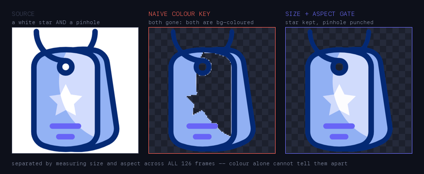
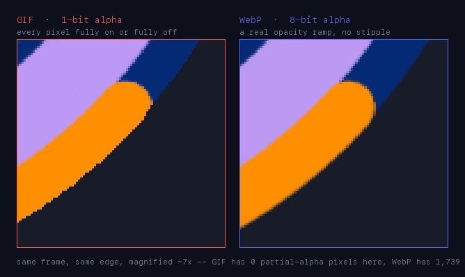
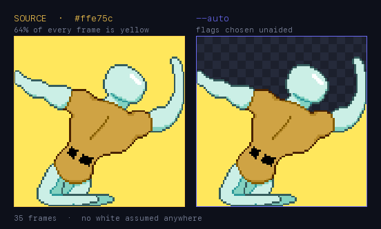
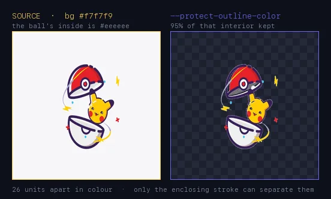
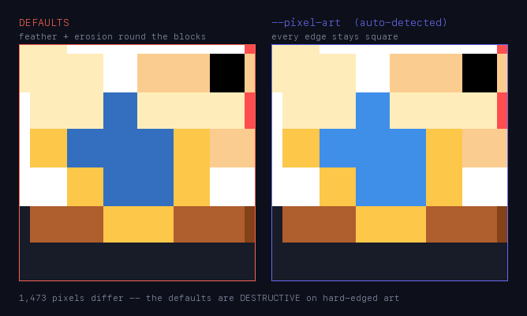
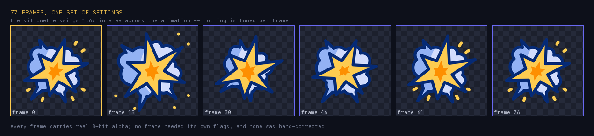

<div align="center">

<br>

# GIF Background Remover

### Chroma-key background removal for animated art — that checks its own work.

<br>

[](https://github.com/HarkiratMangat/gif-background-remover/releases) [](#supported-formats) [](#supported-formats)

<br>

</div>

Strip the background out of an animated icon, sticker or emoji — **while keeping the parts of the design that happen to be the same colour as the background.**

That clause is the entire problem. A colour key deletes the white star inside a badge along with the white behind it. A blanket protection rule keeps the background too. Everything in this tool exists to tell those two apart, and then to prove it got it right.

<br>

---

## What it does that a colour key cannot

### Same colour, opposite treatment



This tag has a **white star** that must survive and a **pinhole** that must be punched through. Both are the background colour. Both sit in overlapping size ranges. Colour cannot separate them — and neither can a single frame, because the star twinkles while the hole stays physically constant.

The discriminator is geometric and measured across **all 126 frames**: the hole holds 423–466px at aspect 1.00–1.04, while the star's fragments range 75–6070px at aspect up to 2.69. `--hole-size-range` and `--hole-max-aspect` admit exactly one component per frame, and it is the right one every time.

### Transparency the source format already destroyed



GIF has **one bit** of alpha — a pixel is fully opaque or fully gone. Every soft edge has to be dithered into a stipple pattern. Write the same mask to WebP or AVIF and the estimated alpha survives as a real opacity ramp.

Further: when a fade was *authored* against the background and flattened by a GIF export, `--recover-fade-alpha` reconstructs it — unmixing each pixel against the art's own palette so the recovered alpha is arithmetic rather than a guess.

### A background that isn't white



*(animated — 35 frames)* A `#ffe75c` yellow filling 64% of every frame, behind a pixel-art creature that twists through the whole animation. **0 background pixels left, 0 artwork pixels lost.** Nothing here assumes white.

Handed to `--auto` with no flags, the skill detected the background colour, recognised the art as hard-edged from its change-line density, and chose **`--pixel-art --tumble-safe --erosion-exempt-max-size 485`** by itself — three separate judgements, none of them supplied.

⚠️ A coloured background is also where the art's own palette is most likely to collide with it, which is exactly why the detector below reads *geometry* rather than colour.

### Two colours 26 units apart



*(animated — 76 frames)* The background is `#f7f7f9`. The inside of the pokéball is `#eeeeee`. That is a per-channel gap of **9, 9 and 11** — inside the default tolerance of 15, so no colour rule can tell them apart, and the interior is an open bowl rather than an enclosed pocket.

What separates them is the dark stroke that encloses the shape: `--protect-outline-color 39215a` keeps **95% of that 593,583-pixel interior** while still clearing the background around it.

⚠️ **`--auto` gets this one wrong today** — it reaches for `--protect-band-only`, which assumes the region sits *outside* the removable core, and destroys the interior entirely. Tracked as a P1; the flag that works is the one above.

### Knowing what kind of art it is



The defaults — feathering, 2px erosion, LANCZOS resampling — assume antialiased vector art. On hard-edged pixel art they are **destructive**, measured at 0% survival on a 31px shape. So the tool decides *which kind of art this is* before it touches anything, using a measure scored against **37 hand-labelled assets**:

| rule | correct | pixel art found | false positives |
|:--|:--:|:--:|:--:|
| single band-ratio measure | 17/37 | 5/25 | 0/12 |
| + zero-transition-band | 19/37 | 7/25 | 0/12 |
| **+ change-line density** | **30/37** | **18/25** | **0/12** |

### Holding up across heavy motion



A 77-frame explosion whose silhouette swings **1.6× in area** between its smallest and largest frame — spikes appearing, debris flying out, the whole shape rebuilding itself. One set of settings covers all of it. No frame was tuned individually and none was hand-corrected.

That is the case where per-frame analysis earns its cost: `--analyze` scans **every** frame rather than sampling, because a shape this mobile breaks any assumption derived from frame 0.

<br>

---

## Start here

**1 — Install.** Python 3, three libraries, one binary:

```bash
pip install pillow numpy scipy
brew install gifsicle              # apt-get install gifsicle on Linux
brew install pngquant webp         # optional: better GIF palettes, WebP inspection
```

**2 — Ask the file what it is.** Never skip this; the defaults are destructive on the wrong art class.

```bash
python3 scripts/remove_gif_background.py input.gif --analyze
```

**3 — Get flags, with the evidence for each one.**

```bash
python3 scripts/remove_gif_background.py input.gif --recommend
```

**4 — Render.** Paste the suggested command, or hand over the whole decision:

```bash
python3 scripts/remove_gif_background.py input.gif output.webp --auto
```

**5 — Check it mechanically**, rather than squinting at a checkerboard:

```bash
python3 scripts/remove_gif_background.py input.gif output.webp --verify
```

> **Which output format?** **WebP** unless you have a reason — true 8-bit alpha, so edges stay soft instead of being dithered. Under a byte cap **AVIF** keeps roughly 3× the frames. **GIF** only when the destination demands it.

<br>

---

## Supported formats

| | GIF | WebP | AVIF | APNG | static PNG/JPEG |
|:--|:--:|:--:|:--:|:--:|:--:|
| **read** | ✅ | ✅ | ✅ | ✅ | ✅ *(one frame)* |
| **write** | ✅ | ✅ | ✅ | — | — |
| **8-bit alpha** | ✗ *1-bit* | ✅ | ✅ | — | — |

The name is historical — the reader is format-agnostic. ⚠️ **Photographs are out of scope.** This is chroma-key removal against a flat, keyable background, not subject segmentation.

<br>

---

## Every option

Five modes replace "run it and hope":

| mode | |
|:--|:--|
| `--analyze` | Scan only. Background, candidate regions, edge hardness, tumble risk, small-region histogram. |
| `--recommend` | `--analyze`, then a ready-to-paste command **with the evidence behind each flag**. |
| `--auto` | Recommend → apply (only where you left a default) → render → **re-verify the encoded file** → correct once. Two passes, not a loop. |
| `--auto-erosion` | Picks erosion from *this asset's own* fringe curve, because the metric has no honest global threshold. |
| `--verify` | Leftover background, protected-region coverage, edge fringe, small-region inflation, timing. |

<details>
<summary><b>Background &amp; protection</b> — 8 flags</summary><br>

| flag | |
|:--|:--|
| `--bg-color <hex>` | Background to remove. Auto-detected from frame 0's corners if omitted. |
| `--tolerance <n>` | Per-channel match tolerance (default 15). |
| `--protect-outline-color <hex[,hex…]>` | **The default choice.** Everything enclosed by a closed outline is protected; accepts several independently-outlined regions. |
| `--outline-tolerance <n>` | Tolerance for the outline colour (default 40). |
| `--protect-region circle:cx,cy,r \| rect:x,y,w,h` | Manual region, `;`-separated for several. **A last resort** — a fixed circle rarely matches a real interior's irregular shape. |
| `--remove-region …` | The inverse: force-remove, overriding protection inside it. |
| `--remove-region-feather <px>` | Edge taper for that cut (default 1.5). |
| `--protect-band-only <px>` | Feather only a thin ring around the removable core; force-protect everything else. For when a solid design colour sits near the background. |

</details>

<details>
<summary><b>Edges &amp; content type</b> — 8 flags</summary><br>

| flag | |
|:--|:--|
| `--pixel-art` | Preset for hard-edged art: no feather, no erosion, nearest-neighbour resize. |
| `--no-feather` | Hard colour-distance cutoff (choppier edges). |
| `--feather-band-multiplier <f>` | Transition-band width as a multiple of `--tolerance` (default 4.0). |
| `--edge-cleanup-erosion <px>` | Erodes the opaque/transparent boundary to clear feather fringe. Context-resolved: 0 for WebP/AVIF, 1 under `--dither-mode none`, else 2. |
| `--erosion-exempt-max-size <px>` | Exempt removed regions at or below N pixels from erosion. |
| `--erosion-exempt-transient` | Exempt by **identity** rather than size — stable across frames = design, comes and goes = incidental. For when the two overlap in size. |
| `--dither-mode {bayer,none,continuous}` | How feathered edges resolve to the container's alpha. |
| `--bayer-size {4,8}` | Threshold-matrix size (default 8 — 64 levels against 4×4's 16, tracking intended alpha 2.5× more closely). |

</details>

<details>
<summary><b>Animated &amp; tumbling content</b> — 4 flags</summary><br>

| flag | |
|:--|:--|
| `--tumble-safe` | For a foreground that rotates or translates across the canvas. Defines background as the largest connected bg-coloured component per frame instead of trusting border-touching. |
| `--keep-bg-blob-if-near <hex[,hex…]>` | Keep a small bg-coloured region only if it borders one of these colours. |
| `--hole-size-range min,max` | Restrict removal eligibility by measured pixel count. |
| `--hole-max-aspect <f>` | …and by bounding-box aspect, excluding thin slivers. |

</details>

<details>
<summary><b>Transparency recovery</b> — 2 flags</summary><br>

| flag | |
|:--|:--|
| `--recover-fade-alpha` | Reconstructs partial alpha that a GIF export flattened into progressively paler background-coloured pixels. Needs a WebP/AVIF output. |
| `--fade-color <hex[,hex…]>` | Name the fading element when it is too brief or too small to auto-detect. |

</details>

<details>
<summary><b>Format &amp; encoding</b> — 6 flags</summary><br>

| flag | |
|:--|:--|
| `--format {auto,gif,webp,avif}` | Container. `auto` reads the output extension. |
| `--webp-lossy` · `--webp-quality <n>` | Lossy WebP (default 90). Lossless is usually **smaller** on flat vector art — measured 2109 KB against 3005 KB on the same asset. |
| `--webp-method <0-6>` | Encoder effort (default 2 — costs 0.6–8.3% more bytes than m4 and encodes ~2× faster). |
| `--avif-quality <n>` | AVIF quality (default 70). Fits roughly **3× the frames** of WebP under the same byte cap. |
| `--quantizer {pil,pngquant}` | GIF master-palette algorithm (`pil` measured smaller on this skill's typical art). |

</details>

<details>
<summary><b>Size, canvas &amp; batching</b> — 8 flags</summary><br>

| flag | |
|:--|:--|
| `--target-kb <n>` | Walk optimize → medium → heavy, then escalate stride/scale, until it fits. |
| `--compress {optimize,medium,heavy}` | Named tiers: crop, resize to 512px, 1px erosion, `gifsicle -O3`, plus lossy/palette steps. |
| `--resize-max-dim <px>` | Arbitrary downscale target, standalone. |
| `--frame-stride <n>` | Keep every Nth frame, **folding dropped durations into the kept frame** so total length is unchanged. |
| `--crop` | Crop to the transparent bounding box (automatic within any tier). |
| `--square-pad` | Pad to a square with transparent margin — emoji slots are square. |
| `--batch manifest.json` | Many files in one invocation, with per-file overrides. |
| `--preview sheet.png` | PNG contact sheet over a checkerboard for a fast visual check. |
| `--no-gifsicle-optimize` | A documented no-op, kept so old invocations still parse. Don't reach for it. |

</details>

<br>

---

## Why it verifies itself

`--verify` reopens the **written file** and measures it. That exists because an earlier version reported *"durations preserved exactly"* while writing 168 of 170 frames — it restated what it *intended* to write and never opened the result.

The same principle runs through the analysis: the fringe metric reports `null` when a value lands in the range where clean and fringed outputs overlap, rather than guessing. An unverifiable check says so.

<br>

---

## Layout

```
SKILL.md                     operating instructions (loads into context when the skill triggers)
references/
  lessons.md                 postmortems and measured evidence — grep it, never read it whole
  version-history.md         per-version detail
  compression.md             the standalone size levers
  flag-reference.md          what individual quality flags do
scripts/
  remove_gif_background.py   the tool (~5,500 lines)
  audit_docs.py              release gate: docs against the real CLI
```

`references/lessons.md` opens with a symptom → section table. White edge, flicker, wrong duration, a check that disagrees with your eyes — that table is the fastest route to whichever case already documented it.

<br>

---

## Working on it

This repo is the development copy of a Claude skill. `SKILL.md` and `references/` are packaged as a `.skill` bundle, attached to every [release](https://github.com/HarkiratMangat/gif-background-remover/releases).

```bash
python3 scripts/audit_docs.py    # must exit 0 before any release
```

It gates the docs against the real CLI — every flag reachable from the instructional body rather than only from a changelog, every cross-reference resolving, and the skill description within the platform's 1024-character limit. **Each of those checks exists because that exact failure shipped once.**
